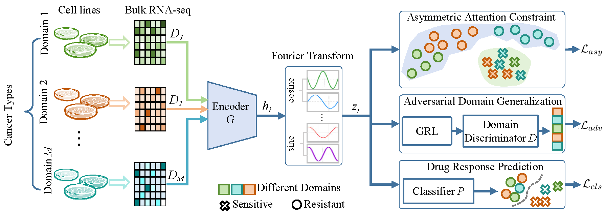

# Generalizing drug response prediction by Fourier asymmetric attention on domain generalization

panCancerDR is a novel domain generalization framework designed to predict drug response in out-of-distribution samples, including individual cells and patient data, using only in vitro cancer cell line data for training. By leveraging adversarial domain generalization and innovative feature extraction techniques, panCancerDR addresses the limitations of traditional domain adaptation methods, which are unsuitable for unseen target domains.


## **1.  Clone Repository

~~~bash
git clone https://github.com/hliulab/FourierDrug.git
cd FourierDrug
~~~

## **2. Unzip datasets
Enter the datasets directory, and you will find five compressed files. Each corresponds to the experiments conducted in this study: the LOOV GDSC dataset (hold-out), single-cell drug sensitivity (single-cell), GCGA patient drug response (patient), drug response dynamics transition (dynamic), and the ablation experiment (ablation). You may extract the dataset of interest to proceed with the subsequent steps.
~~~bash
unzip dataset.zip
~~~

## 3. Create Python environment

We provide an environment.yml file, which can be directly used to create the environment with Conda:

```bash
cd code
conda env create -f environment.yml
```

After the environment is created, activate it:

```bash
conda activate FourierDrug
```

------

## 4 Reprouduce Experiments
### 4.1 Validation on hold-out cancer types 

This experiment performs validation on the GDSC cell line drug response dataset, where all cell lines from one cancer type are held out as the test set in each fold, and the remaining data are used for training. Run the following command to train the FourierDrug model for a specific drug of interest and then perform testing:

```bash
python cell_line.py --source_path ../datasets/hold-out/cell_Afatinib.csv
```

Parameter description:

- `--source_path`: Specifies the path of input data file. This example specify the path `../datasets/hold-out/cell_Afatinib.csv`, and you may replace it with other datasets in the `hold-out` folder as needed.
------


------

## 4.2 Single-Cell Experiment Instructions

运行以下命令来训练 **Single-Cell Experiment**：

```bash
python Single-cell.py --drug_name Afatinib --source_dir ../datasets/single_cell/Afatinib.csv --target_dir ../datasets/single_cell/Target_expr_resp_z.Afatinib_tp4k.csv
```

参数说明：

- `--drug_name`：指定药物名称（此处为 **Afatinib**）。
- `--source_dir`：输入数据文件路径（此处为 `../datasets/single_cell/Afatinib.csv`）。
- `--target_dir`：目标表达及反应数据文件路径（此处为 `../datasets/single_cell/Target_expr_resp_z.Afatinib_tp4k.csv`）。

通过指定single_cell中的文件改变训练数据集。

## 4.3 Patient Experiment Instructions

运行以下命令来训练 **Patient Experiment**：

```bash
python TCGA.py --drug_name Afatinib --source_dir ../datasets/single_cell/Afatinib.csv --target_dir ../datasets/single_cell/Target_expr_resp_z.Afatinib_tp4k.csv
```

参数说明：

- `--drug_name`：指定药物名称（此处为 **Afatinib**）。
- `--source_dir`：输入数据文件路径（此处为 `../datasets/single_cell/Afatinib.csv`）。
- `--target_dir`：目标表达及反应数据文件路径（此处为 `../datasets/single_cell/Target_expr_resp_z.Afatinib_tp4k.csv`）。

------

通过指定patient中的文件改变训练数据集。

## 4.4 Time-Series Experiment Instructions

运行以下命令来训练 **Time-Series Experiment**：

```bash
python timeseq.py
```
